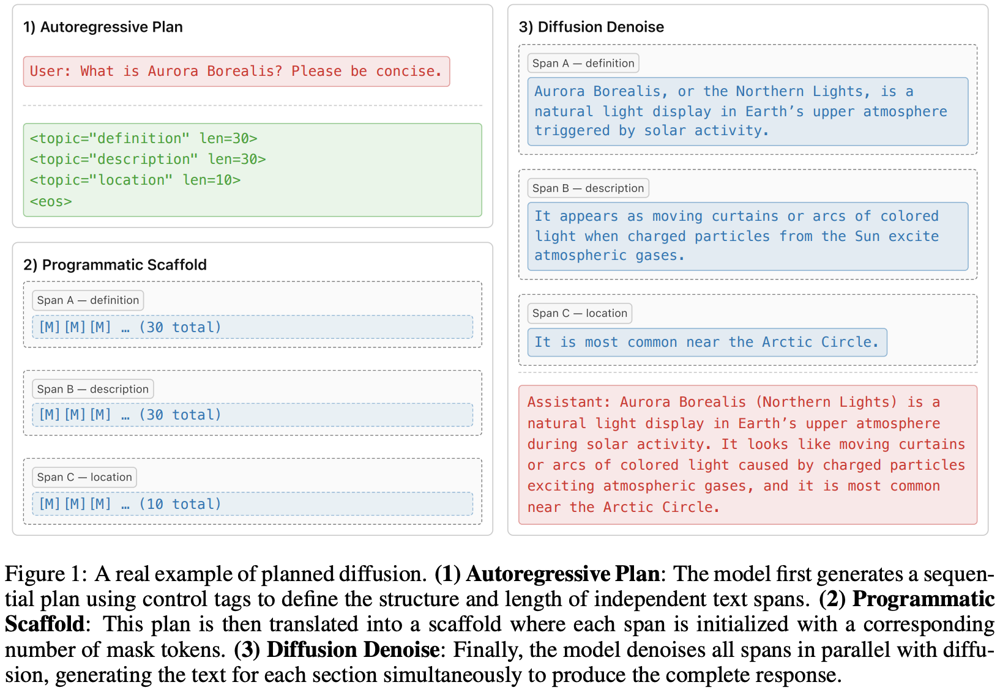
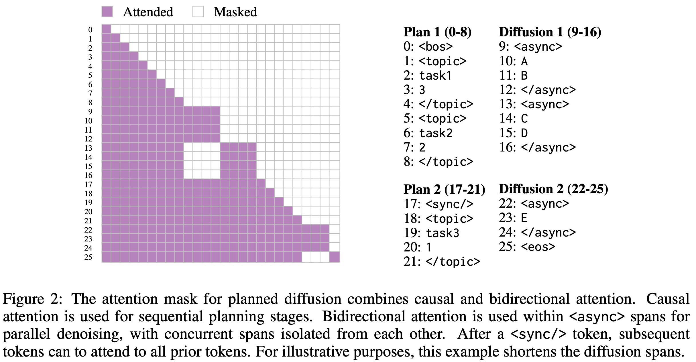
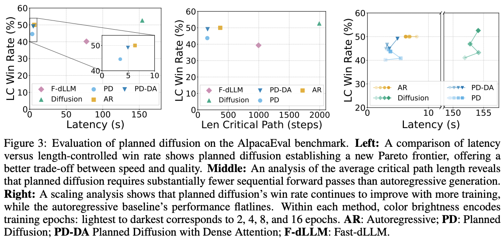

---
tags:
- LLMs
- diffusion
- efficient-inference
potm_order: 2
paper_title: Planned Diffusion
paper_authors: Daniel Israel, et al.
paper_orgs: University of California, Los Angeles, MIT CSAIL, Google
paper_link: https://arxiv.org/abs/2510.18087
review_authors:
- benoitg
---

### The key idea

Planned diffusion introduces a hybrid approach combining the strengths of autoregressive and diffusion models.
First, the model autoregressively generates a plan, breaking the task into semantically independent spans.
Second, the model generates these spans in parallel via discrete diffusion.

### Method
In the first stage, the model sequentially generates a plan $z = (z_1, z_2, \ldots, z_N)$ given an initial context $c$ (user prompt or any previously generated tokens).
It specifies a set of $b(z)$ semantically independent spans as well as the length of each span $l_k(z)$, $k \in {1, \ldots, b(z)}$.
During the diffusion phase, the sequences $x(k)$ corresponding to each span $k \in {1, \ldots, b(z)}$ with $|x(k)| = l_k(z)$ are generated in parallel.
The full joint distribution given context $c$ is defined as

$$p_{PD}(x, z \mid c) = p_{AR}(z \mid c) p_{D}(x \mid z, c) = p_{AR}(z \mid c) \prod_{k=1}^{b(z)} p_{D}(x(k) \mid z, c),$$

where $x = \bigcup_{k=1}^{b(z)} x(k)$, and $p_{AR}$ and $p_{D}$ denote, respectively, the auto-regressive distribution of the planning stage, respectively the distribution of the discrete diffusion model in the diffusion stage.

#### Training and special attention masking
The training loss combines an autoregressive loss and a discrete diffusion loss.
More specifically, given a sequence $Y$ decomposed into sets of planning tokens $Z$ and content tokens $X$, such that $Y = Z \cup X$, and a model $f_\theta$ parameterized by $\theta$ with masking function $M_i$, the overall loss is defined as:

$$\mathcal{L}(\theta) =
\underset{\underset{t \sim U(0,1)}{Y \sim \mathcal{D}}}{\mathbb{E}}
\frac{1}{|\mathcal{Y}|}
\sum_{y_i \in \mathcal{Y}} \Big[
\mathbb{1}(y_i \in Z), CE\big(f_\theta(y_{<i}, i), y_i\big)
	•	\frac{1}{t}, \mathbb{1}(y_i \in X), CE\big(f_\theta(M_i(Y_t), i), y_i\big)
\Big]$$

where $Y_t = X_t \cup Z$ and $X_t$ denotes the noised sequence under the discrete diffusion process.
The first term in the sum corresponds to the autoregressive loss, while the second term corresponds to the diffusion loss.

#### Data
A synthetic data curation pipeline produces training data annotated with planning control tags, using Gemini to label the SlimOrca instruction-finetuning dataset.

#### Inference
Several techniques are used to improve sampling performance and efficiency: variable-length denoising, where the number of denoising steps depends on the length of the longest span; KV caching; and entropy-ordered unmasking.

### Results
The base model is first pre-trained autoregressively and then further pre-trained with a diffusion objective. It is subsequently fine-tuned on the synthetic dataset using four decoding strategies: autoregressive, diffusion, Fast-dLLM, and Planned Diffusion.
Planned Diffusion demonstrates promising improvements by establishing a new latency–quality Pareto frontier, achieving up to ~1.8× faster decoding compared to standard autoregressive generation, and continues to improve with additional training, whereas the autoregressive baseline plateaus. However, these gains come at the cost of a small decline in LC win rate, reflecting a minor trade-off in instruction-following quality for reduced latency.

