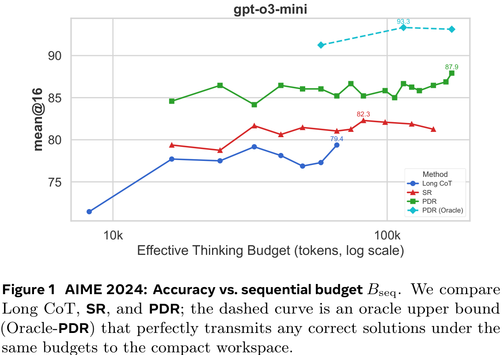
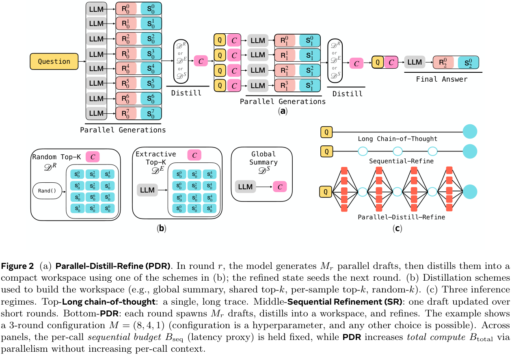
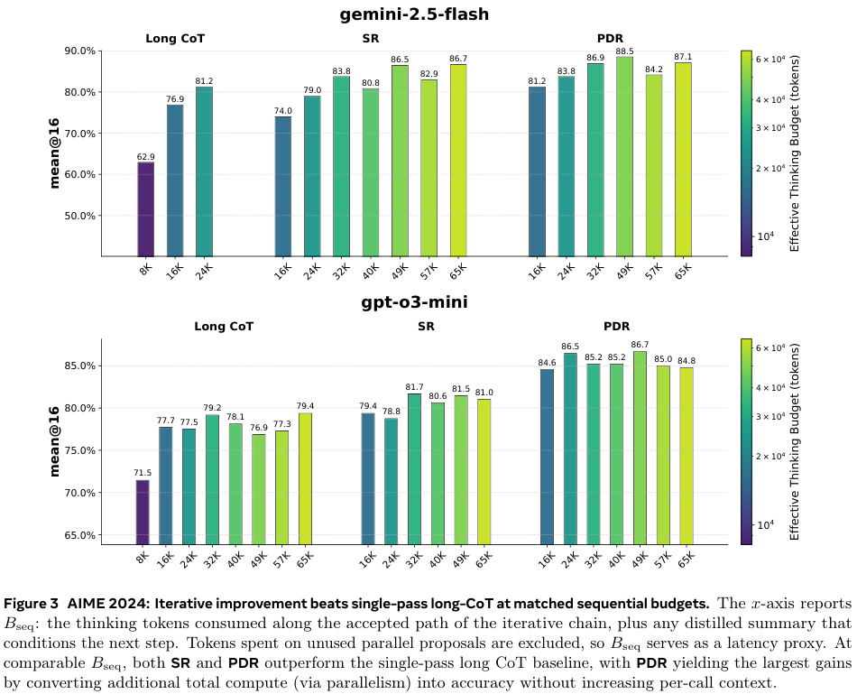

---
tags:
- LLMs
- reasoning
- reinforcement-learning
potm_order: 3
paper_title: 'Rethinking Thinking Tokens: LLMs as Improvement Operators'
paper_authors: Madaan, et al.
paper_orgs: Meta, UCL, Mila, Anthropic, Princeton
paper_link: https://arxiv.org/abs/2510.01123
review_authors:
- samot
---

### The Key Idea

Training LLMs to *reason* incentivises them to output their *chain of thought* (CoT). Amongst other things, this allows them to explore different strategies, and backtrack if needed. The performance gains are undeniable, but they come at a *significant* cost: their CoTs are typically *very long*, inflating the context length perhaps an order of magnitude. Not only is this expensive, but, perhaps more importantly, it increases answer latency.

The current paper addresses the inflated context by viewing the thinking process as an *improvement operator*: it is given a *bounded* workspace, which it uses to refine its current answer.

Their *Parallel-Distill-Refine* (PDR) approach, detailed below, permits parallelised access to the workspace, reducing latency issues; they term the non-parallelised version *Sequential Refinement* (SR).

The authors measure accuracy vs *sequential budget*, which is a proxy for latency.

### Background

The standard approach to scaling LLMs to solve harder problems is to give them a greater inference budget: they think for longer and longer, exploring different solution strategies. This is highly unsatisfying due to the quadratic scaling of compute with context length. LLMs may even struggle to 'find' the correct information inside their long reasoning traces—if it even exists.

*Latent reasoning*, in which non-language 'tokens' are used, is often employed to address this: these tokens are supposed to be more 'expressive' than tokens representing natural language, meaning fewer are needed. The current paper takes a very different approach, giving the LLM a *bounded workspace* to suggest new ideas.

### Their Method

The primary tool introduced is *Parallel-Distill-Refine* (PDR). For multiple rounds, PDR performs the following steps with the output of each round seeding the next:

1.  Generate $M \ge 1$ diverse drafts in parallel.
2.  Distil them into a *bounded* workspace: e.g., summarise or pick the top-$k$ drafts.
3.  Refine answer conditional on this workspace.

The overall structure is outlined in Figure 2(a) below. There are various options for "distil", as outlined in Figure 2(b). If no parallelisation is utilised (i.e., $M = 1$), PDR becomes *Sequential-Refine* (SR).

More informally, instead of using long chains of thought, solutions within the allowed budget are generated, and then a bounded, round-wise summary/report is written out. The next phase starts with *only this summary* (and the question), and uses a new available workspace for fresh generations. Importantly, the workspace *is not* persistent across rounds, instead resetting. Thus, iterating the process enables long 'thinking', but with a bounded context size.

Importantly, whilst *total compute* is affected by the number of drafts generated in parallel, *latency* isn't. Performance results are measured against the *sequential thinking budget* $B_\textsf{seq}$ (latency proxy: sum of tokens along accepted path) as well as the total budget $B_\textsf{total}$ (sum of all tokens).

### Results

The main result of the paper is shown in Figure 3 below. It compares the performances at matched *sequential* thinking budget $B_\textsf{seq}$. The figure is given first, then key aspects are summarised in a table below.

| Model         | Budget | CoT  | PDR         |
| ------------  | ------ | -----| ----------- |
| *Gemini 2.5*  | 16k    | 76.0 | 81.2 (+5.2) |
|               | 24k    | 81.2 | 83.8 (+2.6) |
| *GPT o3 mini* | 16k    | 77.7 | 84.6 (+6.9) |
|               | 24k    | 77.5 | 86.5 (+9.0) |

Overall, the improvement is more significant on GPT 3 than Gemini 2.5, although Gemini 2.5 starts from a higher baseline. A 9 percentage-point improvement at 24k budget for GPT o3 is impressive, but it should be noted that GPT o3 at 24k actually performs worse than at 16k. In general, there are serious diminishing returns on increasing the sequential budget, even sometimes negative, suggesting noisy samples.

The results on AIME 2025 (Figure 9 in their appendix, not repeated here) show similar trends, albeit arguably with a greater benefit from increasing the sequential budget.

Unfortunately, no particularly satisfactory plots are given using the *total* budget. Figures 4 and 10 give some indication, but the CoT models are always given far less total budget. This is natural since they have no inherent parallelisation. Still, *some* information can be gleaned from these.

Other experiments include comparing distillation methods and varying the architecture for a given *total* budget—e.g., 'deep & narrow' (generate few in parallel and repeat many times) versus 'shallow and wide' (generate many in parallel and repeat few times).
