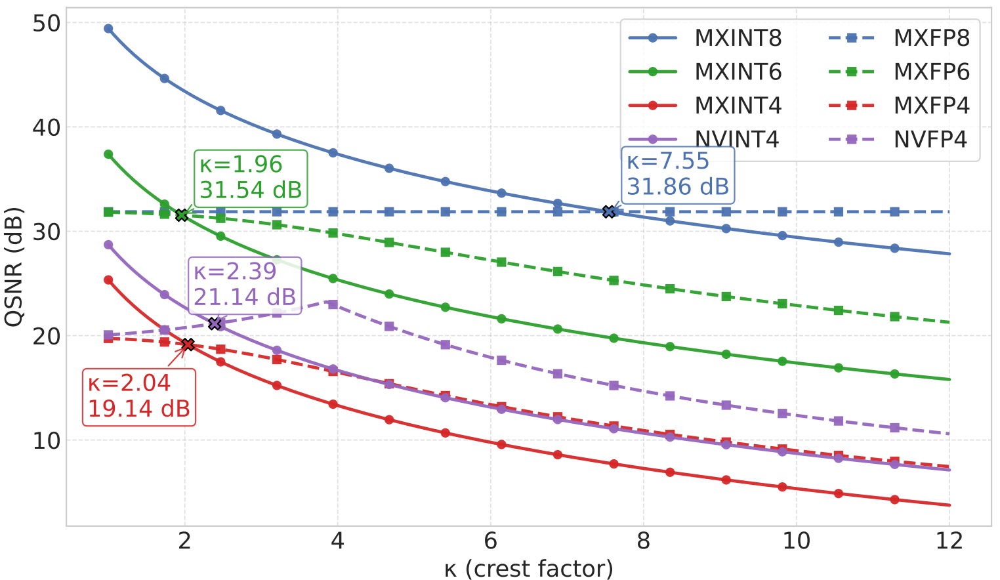
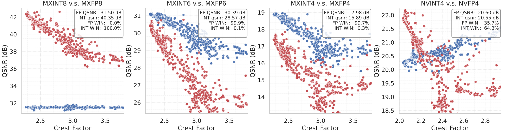
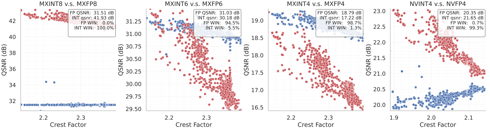

---
tags:
- quantization
- llm
potm_order: 3
paper_title: 'INT v.s. FP: A comprehensive study of fine-grained low-bit quantization
  formats'
paper_authors: Mengzhao Chen, Meng Wu, Hui Jin, Zhihang Yuan, et al.
paper_orgs: University of Hong Kong, ByteDance Seed, PicoHeart
paper_link: https://arxiv.org/abs/2510.25602
review_authors:
- paulb
---

### Background

Integer vs floating point formats has been, and still is, a long debate in the quantization machine learning literature. Historically, research work on neural network low-precision training has mainly focused on how to combine hardware available floating point formats (i.e. FP16, BF16, FP8) with techniques such as loss scaling and tensor scaling to get accurate model training. On the other hand, the (edge) inference literature has extensively covered integer quantization, usually with finer grained scaling resolution (e.g. channel scaling). The later choice motivated by the existence of native `int8` and `int16` vector instructions on numerous hardware platforms, including Arm CPUs on the edge, whereas FP8 hardware support is much more recent and limited [1].

Latest low-precision literature, on training as well as inference, has converged towards the use of fine-grained block scaling formats, with block size 16 or 32. The later provide improved accuracy for machine learning models, while allowing to push towards 4-bits and below formats. In this work, the authors are providing a large overview of different integer and floating point block scaling formats, and how they perform in inference and training scenarios.

### Analysis

The paper provides an in-depth analysis of quantization error, on theoretical Gaussian data as well as experimental training tensors. The quantization signal-to-noise ratio (QSNR) is defined as following:

$$
\text{QSNR} = -10\log_{10} \left( \frac{\lVert X - X_q\rVert_2^2}{\lVert X \rVert_2^2} \right)
$$

With block scaling quantization format, one key metric is the **crest factor**:

$$
\kappa = \frac{\max(|\textbf{X}|)}{\lVert \textbf{X} \rVert_2}
$$

i.e. comparing the peak value of a tensor to its $L^2$-norm. Block scale quantization is usually done by renormalizing all values by the maximum in a block, meaning that if the later is an outlier, the other values will tend to be "squeezed" to the sub-normal range, or flushed to zero. As a consequence, the larger the crest factor is, the more quantization error will tend to be large for low-bits formats.

A theoretical QSNR modelling is provided on Gaussian random data, showing that floating point quantization is showing better signal-to-noise ratio for large crest factor (the cut-off being around 2).

{:.img-medium}

A similar analysis is done on experimental tensors (activations, weights and gradients):

{:.img-medium}

It shows in particular that `int4` is competitive with `fp4` when associated with an FP8 E4M3 floating point scaling factor. Additionally, the combination with random Hadamard rotation on the every block leads to a substantial QSNR improvement on integer formats:

{:.img-medium}

As observed on the x-axis, applying an Hadamard transform will tend to decrease the crest factor of block, as any large outlier will be "spread" over all values. As a consequence, in the 4-bits scenario, most blocks are moved in a crest range favorable to integer quantization.

### Experimental results

The data analysis of the authors is combined with experimental results, on inference and training. On the inference side, a direct-cast comparison in done on a collection of models:

{:.img-medium}

As argued by the authors, integer block formats match the accuracy of floating point formats when combined with Hadamard transforms. It would interesting to see if these results can be extended to quantization aware training, which is nowadays the standard for the optimal accuracy on quantized models.

The authors also validate their approach on LLM pre-training. Training experiments are done on Llama1B and Llama3B models, using the Olmo2 dataset:

{:.img-medium}

As presented in other FP8 and FP4 pre-training papers [2,3], it would be interesting to extend these experimental pre-training runs beyond 100B tokens to validate the result. As seen in these works, using a different numerical precision may have an effect on the training loss curve only later in the training (i.e. after 200-300B tokens).

### References

1. [Arm v9.5A extension with FP8 integration](https://developer.arm.com/community/arm-community-blogs/b/architectures-and-processors-blog/posts/arm-a-profile-architecture-developments-2023)
2. [FP4 All the Way: Fully Quantized Training of LLMs](https://arxiv.org/abs/2505.19115)
3. [Pretraining Large Language Models with NVFP4](https://arxiv.org/pdf/2509.25149)
4. [QuaRot: Outlier-Free 4-Bit Inference in Rotated LLMs](https://arxiv.org/abs/2404.00456)
