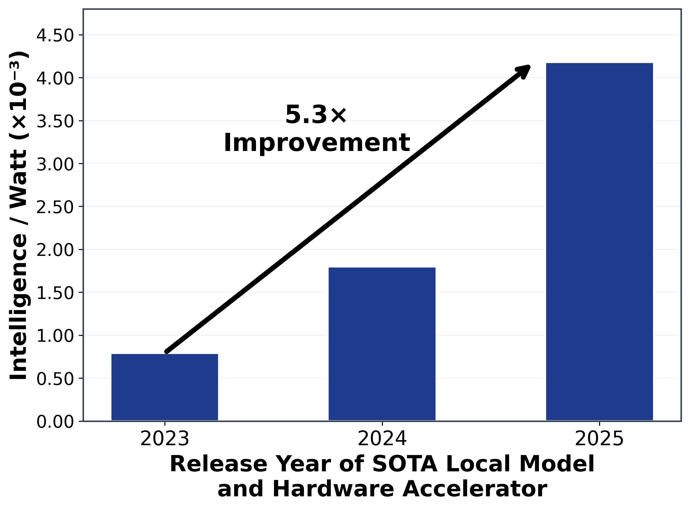

---
tags:
- inference
- power
- efficiency
potm_order: 2
paper_title: 'Intelligence per Watt: Measuring Intelligence Efficiency of Local AI'
paper_authors: Jon Saad-Falcon, et al.
paper_orgs: Standford University, Together AI
paper_link: https://arxiv.org/abs/2511.07885
review_authors:
- sylvainv
---

### The key idea

Can small local AI models shoulder a big portion of today’s AI workload—and do so efficiently? A new study by Saad-Falcon et al. tackles this question by introducing intelligence per watt (IPW) as a metric, defined as task accuracy per unit of power. The backdrop is an exploding demand for LLM inference that strains cloud data centers. Two trends make a case for local inference: open-source LLMs with ≤20B parameters approaching frontier-model performance, and increasingly powerful consumer hardware (e.g. Apple’s M4 chip) that can run these models at acceptable speeds.

By measuring accuracy, energy, and latency on 1 million real queries across 20+ modern local LMs and various accelerators, the authors assess whether local devices can meaningfully offload work from centralized cloud servers. The bottom line is promising – efficiency, not just raw capability, could drive a paradigm shift from cloud-centric AI toward hybrid or even predominantly local AI inference.

### Their method

In order to determine if Local AI models can answer queries, the researchers have selected 1M tasks from different datasets (WildChat, MMLU PRO...), covering chat, reasoning, expert knowledge, and economic breadth. 20 Open-weights models are selected including Qwen3, Gpt-oss, Gemma3, and compared against SOTA closed models (GPT-5, Gemini 2.5 PRO, Clause Sonnet 4.5). Answers are either graded with an LLM-as-a-judge evaluation or via exact match where ground truths exist. Accuracy and Perplexity per Watts are measured via an an [open-source benchmarking harness](https://github.com/HazyResearch/intelligence-per-watt) including high-temporal resolution.

### Key Findings

**Local models can answer most questions.** Small on-device LMs can correctly handle 88.7% of single-turn chat and reasoning queries. In fact, when each query is routed to the best-suited local model (out of a pool of 20), the local setup outperforms a cloud-only approach on 3 out of 4 benchmark tasks. Creative queries see >90% accuracy, whereas highly technical domains are lower at ~68%, indicating some gaps remain. These results underscore that modern local models can now answer a majority of everyday users' queries.

**The intelligence-per-watt of local AI systems has improved 5.3× over the last two years.** This reflects a combination of better models and better chips – roughly a 3.1× gain from model improvements (architectures, training, distillation) and a 1.7× gain from hardware efficiency. Smaller models are getting smarter, and devices are getting more power-efficient, multiplying their combined impact. Figure 1 below illustrates the jump in IPW from 2023 to 2025, based on the best model-accelerator pair each year.

{:.img-large}

**Cloud still has an efficiency edge.** Despite the progress, today’s purpose-built datacenter accelerators remain 1.4×–2.3× more efficient (higher IPW) than consumer-grade chips when running the same model. The study found that a laptop-class Apple M4 Max delivered about 1.5× lower IPW than an enterprise NVIDIA GPU on identical model inference. This efficiency gap highlights room for improvement in local hardware. The authors note that it “justifies continued hardware specialization for local AI workloads” going forward.

**Hybrid local-cloud inference saves energy.** Perhaps the most practical finding is that a smart routing system can yield enormous resource savings. If an oracle router always chooses the smallest adequate local model for each query (and falls back to a larger cloud model only when needed), the analysis showed a ~80% reduction in energy consumption and similar drops in compute and cost, compared to using cloud-only LLMs. Even a more realistic router (e.g. one that guesses correctly 80% of the time) can cut total energy use by 60% without hurting accuracy. Given the current challenge in building AI inference capacity globally, shifting load to local devices is a compelling proposition.

### Limitations

This paper is a good first step in figuring why and how local AI inference capabilities in devices should be prioritized. The systems in use are measured running fairly simple scenarios that may not reflect real-world usage.

First, the evaluation focused on single-turn Q&A and reasoning tasks, so it did not cover multi-turn dialogues or very specialized workflows (e.g. tool use, web browsing by an agent). There are many query types where local models might struggle or require larger contexts than a device can handle.

Second, the impressive “local vs cloud” comparison stacks the deck in favor of local: the best-of-local ensemble drew from 20 models (ranging from 1B to 32B parameters), whereas the cloud baseline used only a few top-tier models. In practice, designing a very good local router and serving multiple models on-device is an unsolved engineering challenge.

Finally, while local inference showed “interactive” latencies, the user experience of a hybrid system wasn’t deeply examined. Networking, model loading times, and other systems factors would affect real-world responsiveness in a local-plus-cloud deployment. Batch sizes have been kept to 1 for simplicity, which is not at all reflective of large inference systems. Those need to achieve very high utilization to be cost effective and hence resort to many optimisations around caching, continuous batching, speculative decoding and more.

### Takeaways

Intelligence per Watt is a timely metric that captures the real progress in making AI both smarter and leaner. This paper shows that a significant fraction of LLM queries could be served locally today, at a fraction of the energy cost, and that fraction is growing every year. For AI researchers and engineers, it’s a call to prioritize power-efficient model design and to co-design algorithms with hardware. For the industry, it hints at a future where personal devices handle much of the AI workload needs to be accounted for. Achieving that vision will require continued advances in both local models and silicon. The trajectory outlined here makes it look not only feasible, but perhaps inevitable.