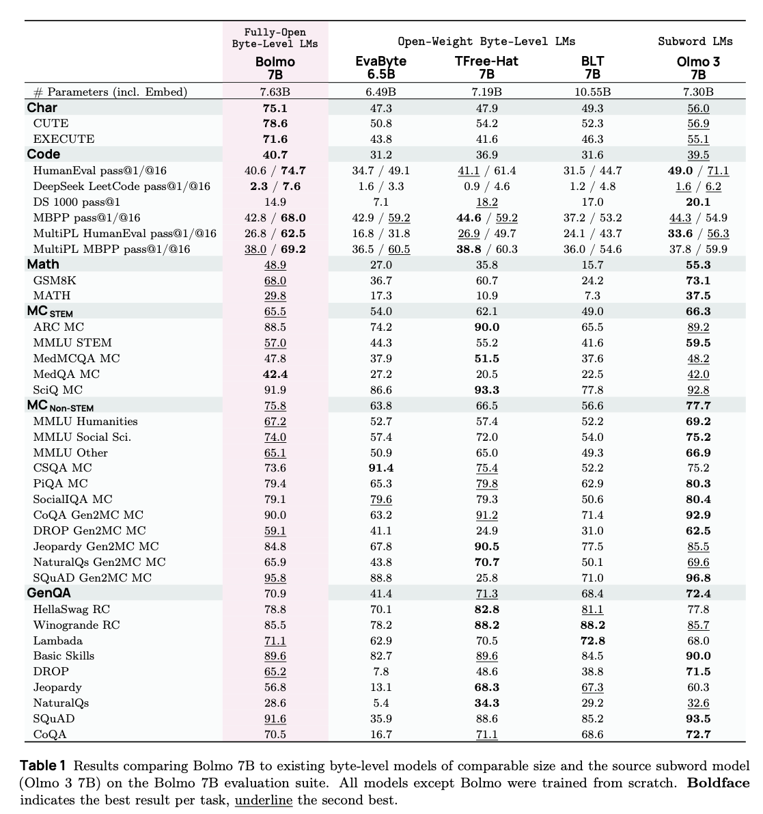

---
tags:
- LLMs
- byte-level
potm_order: 3
paper_title: 'Bolmo: Byteifying the Next Generation of Language Models'
paper_authors: Benjamin Minixhofer, et al.
paper_orgs: Allen Institute for AI, University of Cambridge, University of Washington
paper_link: https://arxiv.org/abs/2512.15586
review_authors:
- lukar
---

### The key idea

Although state-of-the-art language models predominantly use tokenisation (e.g. byte-pair encoding) to pre-process text into subwords, this can lead to undesired behaviours, such as poor character-level understanding, tokenisation bias, and issues with generalisation across languages. Moreover, the full model is called each time a new token is generated, suggesting that a more compute-optimal approach might be obtainable by dynamically altering the amount of compute based on the difficulty of predicting the next token.

Due to this, there has been ongoing work on developing *byte-level* models that do not use standard tokenisation techniques, but either learn how to group bytes end-to-end, or use alternative heuristics. In this work, the authors build upon previous work (such as [DTP](https://arxiv.org/abs/2211.09761), [BLT](https://arxiv.org/abs/2412.09871), and [H-Net](https://arxiv.org/abs/2507.07955)) in order to introduce a method for *byteifying* a language model, i.e., taking a pre-trained tokenised language model and converting it to a model operating on the byte sequences. The obtained 7B and 1B models outperform other byte-level models of similar sizes, while remaining competitive with the original models they are derived from.

### Their method

**Architecture**

The overall architecture of the model is presented in Figure 1. The main building blocks are:

- **Tokenisation & Embedding**: The first step is to embed each byte in the input sequence into a $d$-dimensional vector to be processed by the rest of the model. The most straightforward way is to use a $256 \times d$ embedding table to look up the embedding for each byte. The authors however add additional local context to the embedding by using the (large) embedding table from the original model: for each byte, the longest token (from the original vocabulary) ending at that byte is found, and its embedding is added to the byte representation.

- **Local Encoder**: The role of the local encoder is to enrich the representation of each byte with local context further; here, the authors use a single [mLSTM](https://arxiv.org/abs/2405.04517) layer.

- **Boundary Predictor**: The role of the boundary predictor and pooling blocks is to group bytes into *patches*, that will then be processed by the global transformer model. At each byte position, the boundary predictor outputs a score between 0 and 1; if the score is above a predetermined threshold, a patch boundary is placed there. The boundary prediction here is *non-causal*; it is determined by the cosine similarity between projections of the current and *next* bytes' hidden representations. As a result, this boundary predictor is only used during the prefill stage. Note that the standard tokenisation methods such as byte-pair encoding are also non-causal, as the succeeding text influences the final sequence tokenisation.

- **Pooling**: Once the patch boundaries are determined, the byte representations within each patch need to be pooled into a single patch representation. The pooling choice here is simple, as the patch representation is taken to be the representation of the last byte within the patch.

- **Global Model**: This is the main part of the architecture contributing to the bulk of the overall model's parameters. It uses the same transformer network of the original model (operating here on a sequence of patches instead of tokens).

- **Depooling**: The output of the global model is the sequence of "next-patch" representations, that then need to be turned into the sequence of next-byte predictions. The depooling layer adds a linear projection of the byte representations (output of the local encoder) to corresponding next-patch representations.

- **Local Decoder**: The role of the local decoder is to finally provide next-byte predictions using the output of the depooling layer. Analogously to encoding, this is done with an mLSTM network; the decoder however uses more layers (four), compared to the single layer in the encoder.

- **Language Modelling Head**: The final layer generates the next-byte probability distribution over the 256-long vocabulary, using the standard linear projection + softmax. During the generation stage, the non-causal boundary predictor cannot be used to predict patch boundaries. Due to this, the output vocabulary has an additional \<b\> symbol, determining the patch boundaries during generation. As \<b\> would need to be emitted after each patch, the authors instead double the size of the output vocabulary, so that it also contains each byte paired with a boundary symbol.

As the architecture requires additional encoding and decoding layers, while using the same transformer backbone (in the global model), it adds additional parameters compared to the original model (10M additional parameters for the 1B model, 330M for the 7B).

**Procedure**

In order to *byteify* a language model, the authors propose a two-stage approach:

- **Stage 1**: Train the model to replicate the original *exactly*, by freezing the parameters of the global model and training boundary prediction, encoder/decoder, and LM head layers. The boundary predictor is trained to reproduce the original token boundaries, the encoder to match the hidden representations at a fixed depth within the global model, and the decoder to match the next-token probabilities.
- **Stage 2**: Train the entire model end-to-end — this is where the trained patching can be allowed to diverge from the original model's tokenisation.

### Results

The 7B model is trained from the Olmo 3 7B checkpoint on 9.8B tokens (Stage 1), followed by 39.3B tokens (Stage 2), using the Dolma 3 pretraining dataset (augmented by additional examples to enhance character-level understanding). The model is compared to the Olmo checkpoint with continued training on the same dataset, in order to compare models on the same number of tokens seen in total.

Results are shown in Table 1. Overall, the model shows some degradation in performance compared to the original Olmo 3 model, but showcases improved character-level understanding, as well as better coding results for pass@16. The model also performs better overall than comparable open-weight byte-level language models (these are not compute-matched however).

### Takeaways

This paper is a great read for anyone wishing to catch up on the ongoing line of work on byte-level language models. The authors showcase how pre-trained language models can be distilled into byte-level models, possibly improving character-level understanding, albeit while incurring some loss in task performance. The results on increasing patch size through post-training seem less conclusive, suggesting the potential for future work on training similar architectures from scratch, as well as studying the optimal patch size (which may yield a better performance-efficiency trade-off than standard tokenisation-based transformers). Another significant bottleneck is unlocking batched inference, as the fixed amount of bytes does not lead to a fixed amount of patches/tokens, highlighting an important future challenge.
