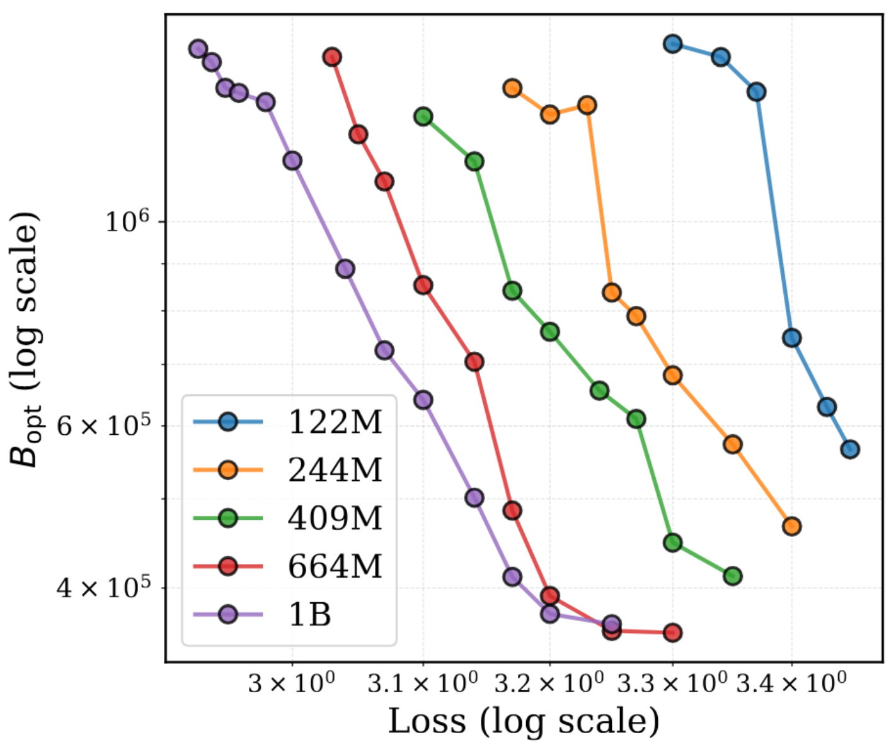
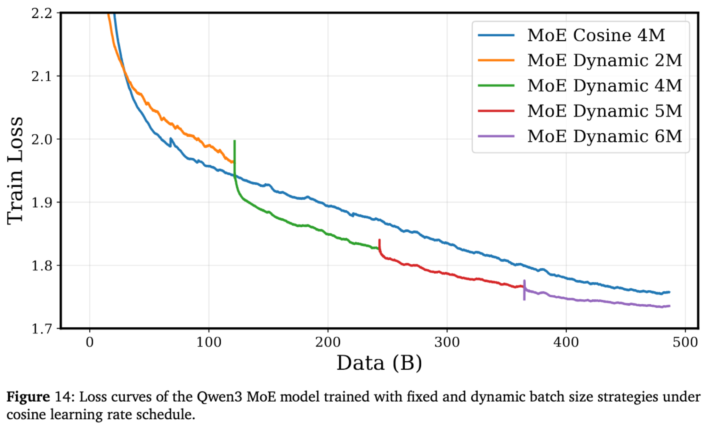

---
tags:
- pretraining
- llm
- training dynamics
potm_order: 3
paper_title: How to Set the Batch Size for Large-Scale Pre-training?
paper_authors: Yunhua Zhou et al.
paper_orgs: Shanghai AI Laboratory, Shanghai JiaoTong University, Fudan University
paper_link: https://arxiv.org/abs/2601.05034
review_authors:
- callumm
---

The batch size is an important hyperparameter in large-scale pretraining. Larger batch sizes provide less noisy gradients at each step and allow for better parallelisation. However, training on the same data multiple times gives diminishing returns, and large batch sizes consume more data per optimisation step.

The resulting tradeoffs can be expressed in terms of a relationship between the amount of data consumed and the number of optimisation steps. [McCandlish et al. (2018)](https://arxiv.org/abs/1812.06162) identified a relationship between the data consumption $E$ (for “efficiency”, confusingly) and the number of optimisation steps $S$ given by

\\[\left(\frac{S}{S_{min}} - 1\right)\left(\frac{E}{E_{min}} - 1\right) = 1\\]

where $S_{min}$ and $E_{min}$ are the minimum values of $S$ and $E$ respectively that are required to achieve a certain target loss. If $B$ is the (constant) batch size, then using the relation $E = BS$ this can be rearranged to give

\\[E = E_{min} + BS_{min}\\]

Since $S_{min}$ and $E_{min}$ are constants, this would imply that using a larger batch size always requires the use of more data. However, the authors find that this contradicts empirical results - while this is true for the early stages of training, it is not true for later stages. They show this in Figure 1 of the paper, which compares loss curves for training runs with different batch sizes (note that the x-axis is number of tokens here, not number of training steps).

To create a theory that matches these results, they conduct a theoretical analysis and find that for large $S$, the amount of data required to reach a certain target loss is actually affine in $S$, i.e. $E = A_1 S + A_0$ for some constants $A_0, A_1$. Taken together with the previous result that $E$ gets very large as $S$ gets increasingly closer to $S_{min}$, this suggests is that the function $E(S)$ is convex in $S$. The authors thus assume that the function is roughly quadratic around the optimum, giving the following piecewise expression for $E(S)$:

\\[ E(S) = \begin{cases} 
      B_{-1} / (S - S_{min}) + B_0 & \text{if } S_{min} \le S < S_1 \cr
      C(S - S_{opt})^2 + E_{min} & \text{if } S_1 \le S < S_2 \cr
      A_1 S + A_0 & \text{if } S > S_2
   \end{cases}
\\]

This gives ten parameters to fit, with the dimensionality of the search space reduced by requiring $E(S)$ to be continuous and have a contiunuous first derivative. A great number of data points can be generated by assuming that the loss follows a given scaling law with respect to the number of training steps.

The payoff is that, for a given target loss, we can compute the optimal batch size as

\\[B_{opt} = \frac{E_{min}}{S_{opt}}\\]

The authors use their model to compute the optimal batch size for a range of model sizes and loss values, and find that the optimal batch size tends to be larger for smaller target losses. This suggests that increasing the batch size over the course of training may be beneficial.

To investigate this, they compare training a Qwen3 MoE model with a constant batch size of 4M to training with batch sizes of [2M, 4M, 5M, 6M], increasing the batch size at regular intervals. The increasing batch size schedule performs better with a cosine learning rate schedule, and performs better during the “stable” phase of the WSD schedule until most of its advantage is eliminated during the critically important decay phase.

Overall, this paper provides a useful framework for thinking about how the batch size affects pretraining performance. One important limitation of this work is that determining the correct parameters for a given target loss requires conducting several training runs to that loss value with varying batch size, which would likely consume much more time and compute than the planned pretraining run. We hope that future work will provide reliable scaling laws that allow practitioners to extrapolate the optimal batch size for a larger run from data from smaller runs.
