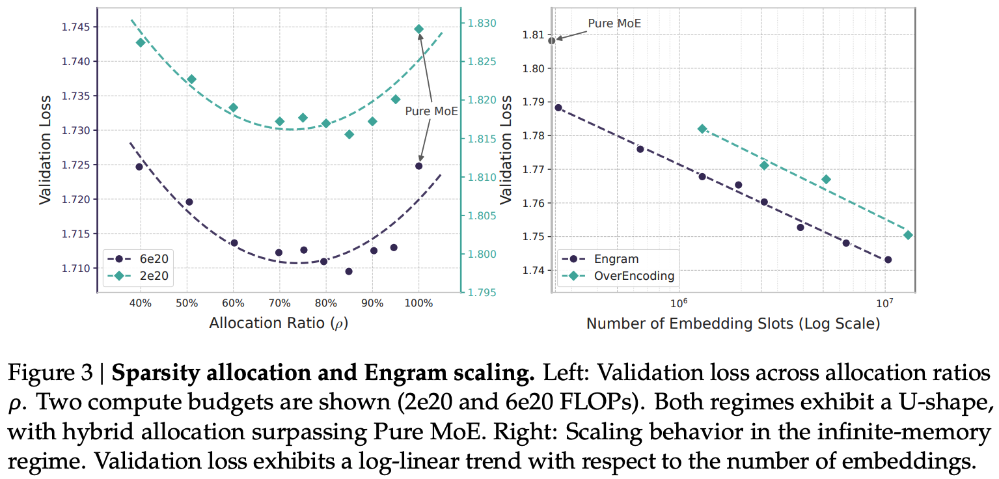

---
tags:
- memory
- sparsity
- LLM
potm_order: 1
paper_title: 'Conditional Memory via Scalable Lookup: A New Axis of Sparsity for Large
  Language Models'
paper_authors: Xin Cheng, et al.
paper_orgs: Peking University, Deepseek-AI
paper_link: https://arxiv.org/abs/2601.07372
review_authors:
- lukep
---

### The key idea

Offloading local dependencies between tokens with lookups to a massive embedding table improves large language model capabilities by freeing up attention capacity to model global context.

### Their method

The authors propose that transformers need a cheap lookup mechanism to retrieve simple local dependencies between tokens, otherwise these dependencies will need to be learned and retrieved by expensive computation over model depth. As a result they design "Engram": a new module built around a lookup primitive with the following components:

* Canonicalisation of input tokens ("canonical tokens"), reducing redundancy by mapping tokens to a smaller set of semantically unique tokens by e.g., merging separate tokens for upper- and lower-case words (*Tokenizer Compression*).
* Constructing n-gram embeddings by hashing sequences of canonical tokens (*Multi-Head Hashing*).
* Using projections of the embeddings as keys and values for a sigmoidal attention-like gating mechanism taking model hidden state as query (*Context-aware Gating*), along with a dilated depthwise convolution to learn dependencies over local n-grams.

* During training: embedding table is sharded across GPU memory, with embeddings retrieved using an all-to-all
* During inference: embedding table is stored in Host DRAM and embedding lookups are offloaded to host CPU and transported over PCie.
* The latency of Host-GPU connections at inference time informs the placement of engram at at the start of the second layer, to allow overlapping of retrieval with computation of the first layer. 
* Design allows for a naive implementation to incurs just 3% overhead, with plenty of room for improvement by exploiting memory hierarchy since engrams are accessed non-uniformly.

### Results

Since lookups add no FLOPs, more parameters can be added via embedding tables without incurring computational costs. However, mixture-of-experts models also add parameters without additional computational cost through sparse compute. As such, the authors aim to determine how best to allocate "inactive parameters" across experts and engram tables. Across two compute budgets, they demonstrate an optimal allocation of 25% of inactive parameters to engram tables. Nevertheless in an unconstrained memory setting, larger tables improve results further.

These results bear out at large scale too. Compared with a 27B parameter MoE model trained for 262B tokens, they demonstrate that Engram augmented models provide improvements on retrieval and comprehension tasks and on several reasoning tasks.

The authors also include an interesting analysis of the representational similarity between Engram and MoE models, finding that earlier layers of Engram augmented models have representations similar to later layers of MoE models, backing up their claim that Engram frees up capacity for modelling complex long-range dependencies in global context.

### Takeaways

Engram is a well-validated, simple, scalable extension of transformers that considers the systems impact of needing to store and retrieve from a massive embedding table in a non-blocking manner during inference. Without having validated the idea myself (yet!), I'm reasonably convinced this is a good addition to the transformer architecture, albeit it is somewhat worrying that manifold-constrained hyper-connections appear necessary for good performance. General adoption of the idea would appear to depend on whether Engram can work without Deepseek architectural variants and whether the 25% parameter allocation continues as models move towards a predicted shift of finer-grained mixture-of-experts models. The design space of memory augmented models is likely to evolve further and indeed [concurrent work](https://arxiv.org/abs/2601.10639) proposes an alternative method of including large embedding tables to replace FFN up-projections to improve knowledge storage. Additionally, systems with tighter CPU-GPU coupling will open up the feasibility of lower latency, more computationally intense lookup functions as scalable primitives.
