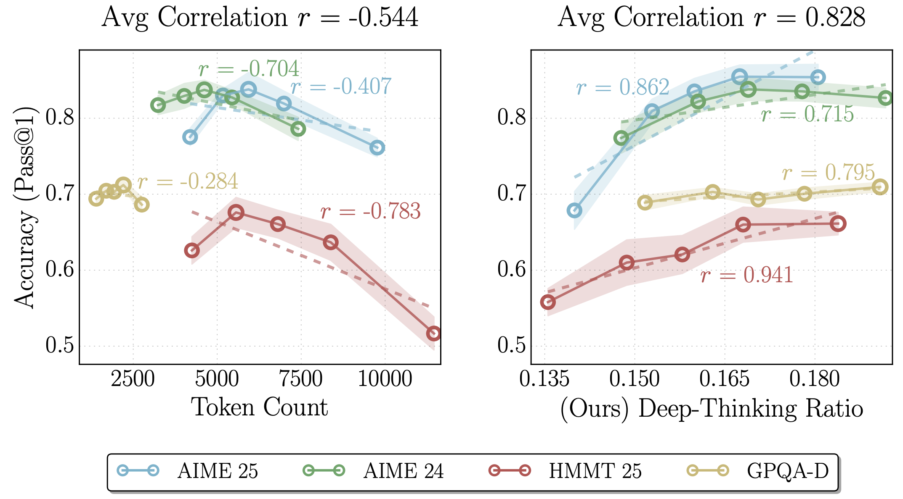
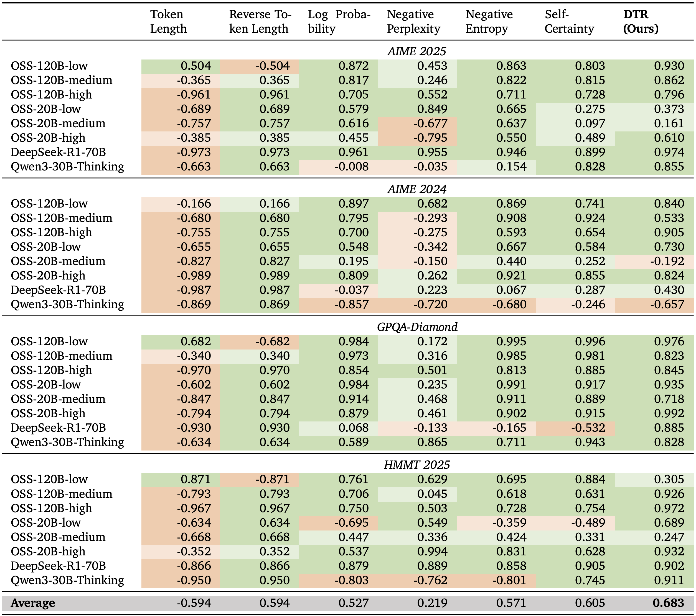
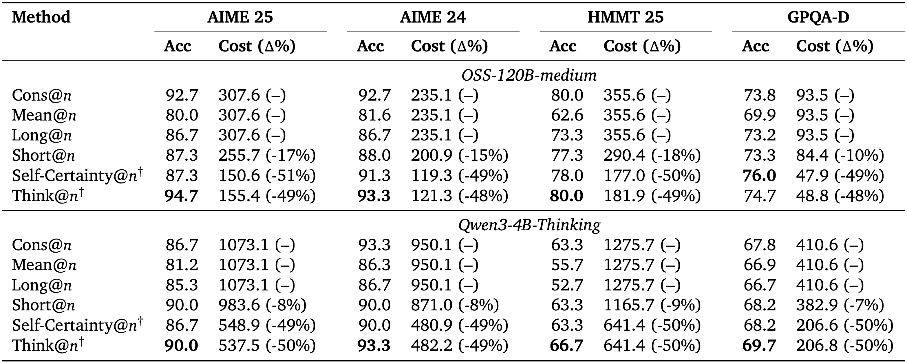

### The key idea

Reasoning models have demonstrated improved task performance when compared to their non-reasoning counterparts. This is largely attributed to reasoning models breaking down problems and working through them step-by-step, a by-product of which is an increased sequence length. Yet, it is not always clear that a longer sequence length correlates with better task performance. This work examines the presence of _deep-thinking tokens_ (tokens in which internal predictions undergo large changes throughout model layers prior to convergence) within the reasoning trace and the proportion of the trace that consists of these deep-thinking tokens (the _deep-thinking ratio_). The authors find strong correlation between the deep-thinking ratio and task performance, and use this to propose a strategy for test-time scaling.

<figcaption>Figure 1.  Comparison of correlations between accuracy and proxies for thinking effort. The plots illustrate the relationship between model performance and two inference-time measures of thinking effort on GPT-OSS-120B-medium across AIME 2024/2025, HMMT 2025, and GPQA-Diamond. (Left) Output token count exhibits a moderate negative correlation (average r = −0.544), suggesting that output length is an unreliable indicator of performance. (Right) In contrast, our proposed deepthinking ratio demonstrates a strong positive correlation with accuracy (average r = 0.828).</figcaption>

### Background

Over the last 18 months, numerous works have suggested that increasing the number of reasoning tokens increases task performance (including [DeepSeek-R1](https://arxiv.org/pdf/2501.12948), [OpenAI o1](https://arxiv.org/pdf/2412.16720), [Qwen3](https://arxiv.org/pdf/2505.09388), [Claude 3.7 Sonnet](https://assets.anthropic.com/m/785e231869ea8b3b/original/claude-3-7-sonnet-system-card.pdf), [Claude Opus 4 & Sonnet 4](https://www-cdn.anthropic.com/6d8a8055020700718b0c49369f60816ba2a7c285.pdf)). However, there is growing evidence indicating that raw token count is an unreliable indicator — the authors of this work propose a new measure which is more correlated with model performance.

### Their method
The authors propose measuring the probability distribution over the vocabulary after each intermediate hidden state, rather than just the final state. For each layer $l=\{1, \cdots L-1\}$ and generation step $t$, the probability distribution $p_{t,l}$ is given by $\mathrm{softmax}(W_U h_{t, l})$ where $h_{t, l}$ is the layer's hidden state and $W_U \in \mathbb{R}^{|V| \times d}$ in the language modeling head to produce logits over the vocabulary. The final layer's probability distribution is given by $p_{t, L}$.

The authors posit that tokens with distributions that stabilise in deeper layers corresponds to needing more extended internal thinking, wheras distributions that stabilise quickly do not benefit from additional thinking. They measure how long a token's distribution takes to stabilise by considering the Jensen-Shannon divergence (JSD) between $p_{t,l}$ and $p_{t, L}$:
$$
D_{t, l} := \mathrm{JSD}(p_{t,L} \parallel p_{t, l}) = H\bigg(\frac{p_{t,L} + p_{t,l}}{2}\bigg) - \frac{1}{2}\big(H(p_t, L) + H(p_t, l)\big)
$$
where $H(\cdot)$ denotes Shannon entropy.

The depth in which the model has "settled" is defined as 

$$
c_t = \min\big\{l \in \{ 1, \cdots, L \} \,:\, \bar{D}_{t, l} \leq g \big\}
$$

where $\bar{D}_{t, l} = \displaystyle\min_{j\leq l}{D}_{t, j}$ defines what a layer has settled at and $g$ is a fixed threshold.

If the settling depth is within later layers (determined by a _depth fraction_ $\rho$), it is considered to be a deep-thinking token. The proportion of these tokens across the overall generated sequence determines the deep-thinking ratio. The authors find that this metric correlates with task performance much more strongly than other metrics such as sequence length (see Table 1 below).

<figcaption>Table 1. Pearson correlations between task accuracy and different inference-time measures, including length-based and confidence-based baselines, across eight model variants and four reasoning benchmarks.</figcaption>

### Results

In order to make this observation useful in practice, the authors propose adopting this metric in best-of-$n$ settings, in which a subset of the $n$ responses are sampled and a majority voting is carried out over the sampled responses. By comparing different sampling strategies (including self-consistency over all responses, mean over all responses, sampling by longest sequences, sampling by shortest sequences, sampling by self-certainty, and finally sampling by their deep-thinking ratio, denoted as _think@$n$_), the authors find consistent improvement in task performance over numerous reasoning benchmarks.

<figcaption>Table 2. Comparison of task accuracy and average inference cost (k tokens) under different aggregation methods, across four reasoning benchmarks. The reported cost reductions (Δ%) are shown relative to Cons@n. Think@n achieves the best overall performance while reducing inference cost by approximately 50%. Methods with † adopt a prefix length of 50 to determine early stopping.</figcaption>

### Takeaways

This work uncovers a new metric for determining how well a model is reasoning. Given the expense associated with long-context lengths, there is great value to the community to find new ways of optimising reasoning traces, and so it will be interesting to see if the ideas explored in this work end up being adopted by those training reasoning models to yield more efficient generation.
