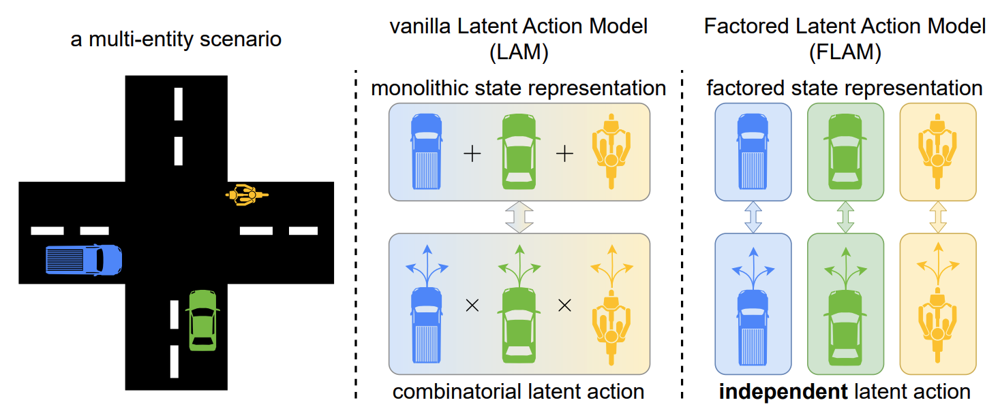

### The key idea

This paper proposes Factored Latent Action Models (FLAM), a framework for learning controllable world models from action-free videos in environments that contain multiple entities acting independently.
Instead of representing scene dynamics with a single latent action for the entire scene, FLAM factorizes the state into multiple entities and assigns each entity its own latent action.
This reduces the complexity of modeling joint actions and improves prediction accuracy and representation quality.
<!-- When applied with reinforcement learning, FLAM allows for improved policy learning in multi-entity environments. -->

### Background

World models aim to learn environment dynamics so that an agent can predict future observations and plan actions. 
Recently, latent action models such as [Genie](https://arxiv.org/abs/2402.15391) have allowed world models to be trained from videos without action labels. These models:

* Use an inverse dynamics model to infer a latent action explaining the transition between two frames;
* Use a forward dynamics model to predict the next frame, given the current frame and an inferred latent action.

This allows controllable dynamics to be learnt from datasets without ground truth action labels, such as unlabelled Internet videos.
However, prior approaches encode _all_ changes in the scene into a _single_ latent action, which becomes difficult when multiple entities act simultaneously, as the latent action has to represent all combinations of actions. This causes the complexity of the action space to grow exponentially with the number of entities.

### Their method

FLAM addresses this limitation by factorizing the state and action representations. The method is trained in two stages.

#### 1. Feature extraction

A VQ-VAE encoder converts each video frame into discrete latent features to provide a compact representation for efficient learning. The VQ-VAE is frozen for the next stage.

#### 2. Factorized latent action learning

The scene is decomposed into $K$ slots (factors) using [slot attention](https://arxiv.org/abs/2006.15055), where causal temporal attention encourages slots to bind consistently to the same object. For each slot:

* An inverse dynamics model infers a latent action that explains the change between the current and next slot state. The predicted action is regularized by sampling from a normal distribution, with KL divergence penalizing deviation of the distribution from a unit normal prior.
* A forward dynamics model predicts the next state of each slot using all the current slot states and the inferred action.

Both dynamics models are implemented using the spatiotemporal attention described in [Genie](https://arxiv.org/abs/2402.15391), with spatial attention to all slots in the current timestep. Finally, predicted slot states are aggregated and can be decoded using the VQ-VAE back into the next video frame.

FLAM is trained end-to-end with

* Prediction loss between predicted and true frame features;
* KL regularization on latent actions, to prevent trivial copying of the next state.

Unlike prior methods, FLAM learns representation and dynamics simultaneously, encouraging slots to correspond to entities defined by independent actions rather than by visual similarity.

### Results

The results show:

* Improved prediction accuracy: FLAM achieves the best results across metrics such as PSNR, SSIM, LPIPS, and FVD compared to prior latent action models and object-centric baselines.
* Successful entity factorization: The learned factors correspond closely to individual agents or correlated groups of agents.
* Robust scaling: Accuracy is stable as the number of slots increases beyond the number of independent entities, and also with an increasing number of entities in the scene.
* Improved policy learning: Latent actions inferred from video can generate pseudo action labels, to enable sample-efficient behavior cloning.
