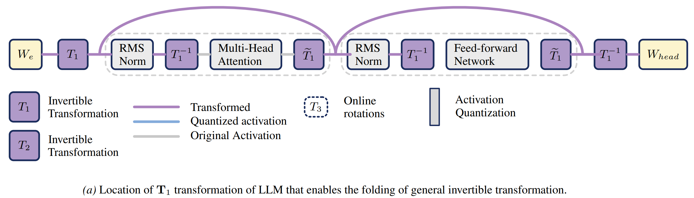
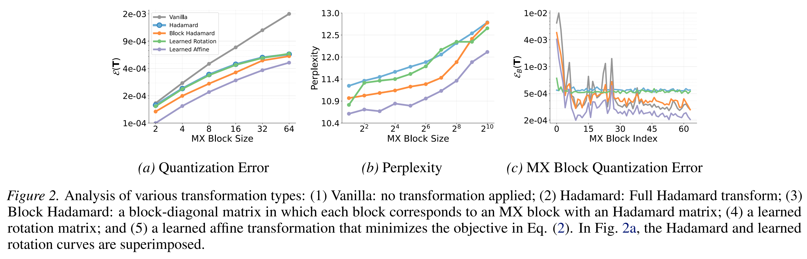
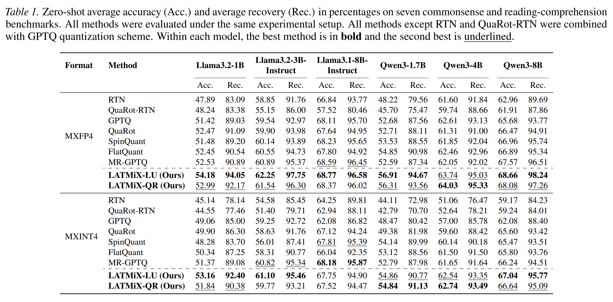

### The key idea

Block-scaled tensor formats such as MXFP use a scaling factor for each block of (e.g. 32) weights or activations, typically derived from the absolute maximum within each block. This means that the quantisation error is sensitive to outliers. While previous works reduce the error by inserting random rotations (e.g. Random Hadamard Transforms) or trained rotations (e.g. QuaRot, SpinQuant) into the compute graph, this work adopts **trained invertible affine transformations**. These are more expressive than rotations, and can still be folded into existing linear operations, with negligible overhead ✨.

_(Partial Figure 4) Compute graph showing $T_1$, one of two affine transformations that can be entirely fused into existing weight matrices; the other transformation $T_2$ is applied to the values in self-attention._

### Background

To quantise a tensor in an MX format, typically:

1. Partition the tensor into blocks (32 elements).
2. Compute the absolute maximum value of each block.
3. Compute the largest scale such that this absolute maximum value, divided by the scale, is within the range of the element format.
4. Divide each element in the block by the scale.
5. Quantise using the element format (rounding, not clipping due to step 3).

Intuitively, the presence of extreme values (often deemed outliers) within a block causes high error for other elements in that block, and makes a poor use of the representational capacity, since most indices in the block will correspond to values near zero.

### Their method

The authors define an invertible affine transformation and inverse:

\begin{align}
T(x) &= A x + v \\
T^{-1}(y) &= A^{-1}y - A^{-1}v
\end{align}

These pairs of transformations and inverses are inserted into the compute graph (see diagram ↑) such that the overall computation is preserved, but the MX cast operations are performed in the transformed space. Local quantisation error in the original representation space is changed from $\mathbb{E}\left[ ||x - Q(x)||_2^2 \right]$ to $\mathbb{E}\left[ ||x - T^{-1}(Q(T(x)))||_2^2 \right]$, an opportunity to reduce error with an appropriate choice of $T$.

**Parametrising $T$** In order to learn an invertible $A$, the authors define two alternative parametrisations, based on the LU or QR decomposition. In the QR case,

\begin{align}
Q &= \mathrm{exp}\left[\frac{1}{2}(G - G^T)\right] \\
A &= Q (R + \mathrm{diag}(s))
\end{align}

where $G \in \mathbb{R}^{d \times d}$ and $s \in \mathbb{R}^d$. $R \in \mathbb{R}^{d \times d}$ is an upper-triangular matrix with zeros on the diagonal. In order to ensure $A$ is invertible, it's sufficient to ensure $\mathrm{det}(\mathrm{diag}(s))>0$, which is done by learning $\log |s|$ and regularise $(\sum \log|s|)^2$ to be close to zero.

**Not quite computationally invariant** So far, I'm afraid I've told a small lie. In generalising from rotations to affine transformations, it is no longer the case that $T_1$ and $T_1^{-1}$ preserve the original computation, due to the nonlinear action of RMSNorm layers and the addition of a bias term $v$. The authors resolve this by adopting a recipe akin to quantisation-aware-training, with the transformations initialised as pure rotations and trained to minimise KL divergence of the model outputs against the unquantised reference model.

### Results

An analysis of the quantisation error shows a clear advantage for the full learned affine transformations of LATMiX, with low error across a wide range of block sizes:

When paired with GPTQ to quantise weights after the transformations have been trained, LATMiX shows strong performance compared to the alternatives (QuaRot, SpinQuant, FlatQuant and MR-GPTQ):

### Takeaways

LATMiX is a promising technique, with strong supporting analysis and results that promote it as an improvement upon random Hadamard and learned rotations. With a very short training phase using KL divergence, it is positioned somewhat between classical post-training-quantisation techniques which use local objectives and quantisation-aware-training methods which fine-tune all parameters with a global objective.
