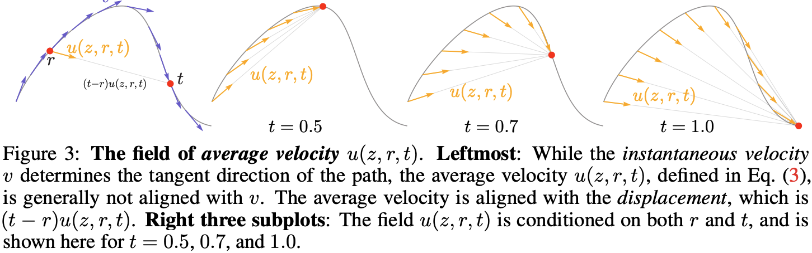
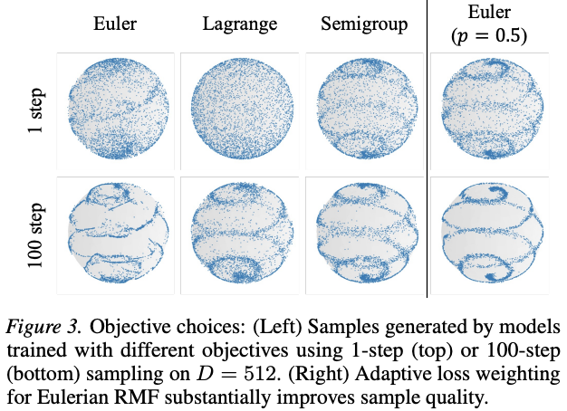
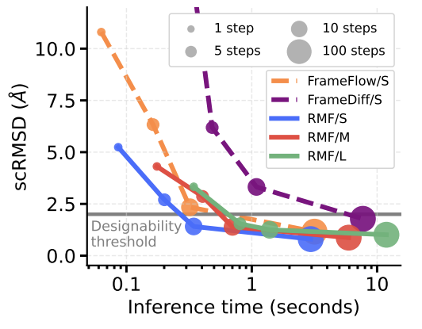

### The key idea

The authors extend the concept of average velocity introduced in [MeanFlow](https://arxiv.org/pdf/2505.13447) to riemannian manifolds, allowing for one- or few-steps generation of geometric data such as protein backbones.

### Background

Many scientific datasets such as protein backbones or mollecule structures, have intrinsic geometry induced by structural constraints that can't be captured with a Euclidean representation. Riemannian geometry is a natural framework to capture the intrinsic geometry of such data. Recent works extend diffusion or flow-matching models to Riemannian manifolds, learning vector fields that transport noise to data along geodesic trajectories. However, these model still present high inference cost as sampling requires numerically integrating an ODE or SDE along the manifold, typically involving tens to hundreds of neural network evaluations.

### Their method

Mirroring flow map methods in the euclidean setting ([Geng et al.](https://arxiv.org/pdf/2505.13447), [Zhou et al.](https://arxiv.org/pdf/2511.19797), [Guo et al](https://arxiv.org/pdf/2507.16884), [Boffi](https://arxiv.org/pdf/2505.18825)), the authors introduce Riemannian MeanFlow (RMF), a framework for few-step generation on Riemannian manifolds. RMF build on the idea of average velocity: the constant velocity that would transport $x_s$ to $x_t$ over time of $t − s$ along a geodesic path on the riemannian manifold.

They derive 3 equivalent characterizations (or identities) of the average velocity on riemannian manifolds and derive the corresponding training objective using effective regression targets.
They further propose a different parametrisation for the average velocity network: $v$**-prediction** where the output of the network is projected to the tangent space directly, the $x_t$**-prediction** where the model directly predicts the flow map and the $x_1$**-prediction** where the network is used to predict a point on the manifold and the average velocity is recovered using the logarithmic map.

### Results

After ablating the design choices of the framework on a toy dataset (e.g. objective and ßparametrization), the authors evaluate RMF on DNA promoter design (simplex in $\mathbb{R}^{1024\times4}$) and protein backbone generation ($SE(3)^N$ for $N$ residues). In both scenarios, RMF achieves comparable or improved performance in fewer neural network evaluations than diffusion or flow matching methods.

### Takeaways
Riemannian MeanFlow provides a principled framework for few-step generation for geometrically constrained data allievating the inference bottleneck intrinsic to diffusion and flow matching methods. It introduces a characterization of the average velocity field on Riemannan manifolds and derives regression objectives. While showing competitive generative performance at reduced inference cost, it relies on (i) an efficient implementation of the Jacobian Vector Product (JVP) and (ii) closed form expressions of the logarithmic map partial derivatives. 
